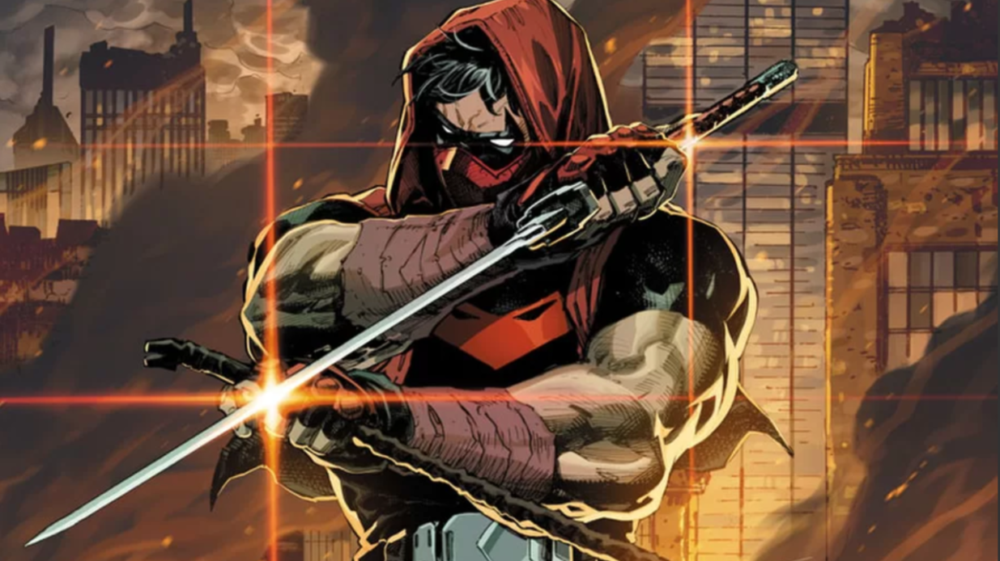

<!-- First banner image -->
<div align="center">
  
</div>

<!-- second banner image -->
<div align="center">
  
</div>

<!-- minibio -->
<h1 align="center">Gabriel Resende da Silva</h1>
<h3 align="center">Ex-Military • Cybersecurity Student • Programming, Linux and Network Enjoyer</h3>

<table align="center">
  <tr>
    <td align="center">
      
    </td>
    <td align="center">
      
    </td>
    <td align="center">
      
    </td>
    <td align="center">
      
    </td>
  </tr>
</table>
<!-- end minibio -->

---

## `Grs-grs@github:~$ nmap -sC -sV -Pn profile.life`

```txt
Starting Nmap 7.95 ( https://nmap.org ) at 2026
Nmap scan report for profile.life
Host is up (0.0010s latency).

PORT      STATE SERVICE         VERSION
22/tcp    open  identity-ssh    Gabriel Resende da Silva
80/tcp    open  role-http       Cybersecurity Student
111/tcp   open  background-rpc  Ex-Military | IT Support 
443/tcp   open  focus-https     Blue Team fundamentals | Networks | Linux | Infrastructure | Programming
8080/tcp  open  career-proxy    Cybersecurity | Network Security | SOC | Purple Team | Security Engineering

Service Info: OS: Debian Linux; CPE: cpe:/o:linux:linux_kernel
Host Script Results:
|_mindset: disciplined | hands-on | resilient

Service detection performed. Please report any incorrect results.
Nmap done: 1 IP address (1 host up) scanned in 0.42 seconds
```

---

## `Grs-grs@github:~$ msfconsole -q`

```txt
msf6 > show exploits

[*] Loading modules...

Available skill modules
=======================
```

<table>
  <tr>
    <td valign="top" width="33%">

### Dev Stack
<p>
  
  
  
  
  
  
  
  
  
  
</p>

**Focus:** backend foundations, APIs, automation, tooling, and infra-friendly development.

</td>
<td valign="top" width="33%">

### Red Team Stack
<p>
  
  
  
  
  
  
  
</p>

**Focus:** recon, service enumeration, web surface exploration, wireless basics, and offensive labs.

</td>
<td valign="top" width="33%">

### Blue Team Stack
<p>
  
  
  
  
  
  
  
  
</p>

**Focus:** defensive fundamentals, visibility, Windows internals, ATT&CK mapping, and practical investigation mindset.

</td>
  </tr>
</table>

```txt
[*] Module arsenal loaded successfully.
msf6 > _
```

---

## `Grs-grs@github:~$ gobuster dir -u https://future.targets/ -w /usr/share/seclists/Discovery/Web-Content/common.txt -s 503`

```txt
===============================================================
Gobuster v3.x
===============================================================
/network-security.............. Network Security (Status: 503)
/soc-ir........................ SOC | Detection | Incident Response foundations (Status: 503)
/linux-hardening............... Linux and system hardening (Status: 503)
/security-engineering.......... Security engineering (Status: 503)
/purple-team................... Purple Team (Status: 503)
/devsecops-cloud............... DevSecOps and cloud security (Status: 503)
/offensive-security-labs....... Offensive security labs and adversarial simulation (Status: 503)
/defensive-security-labs....... Defensive security labs (Status: 503)
===============================================================
```

---

## `Grs-grs@github:~$ gobuster dir -u https://current-focus.life/ -w /usr/share/seclists/Discovery/Web-Content/common.txt -s 202`

```txt
===============================================================
Gobuster v3.x
===============================================================
/ccna-fundamentals............. CCNA and networking fundamentals (Status: 202)
/linux-administration.......... Linux administration and troubleshooting (Status: 202)
/blue-team-mitre............... Blue Team mindset and ATT&CK-based study (Status: 202)
/web-enumeration............... Web enumeration and offensive basics (Status: 202)
/backend....................... Backend with Python / TS (Status: 202)
/infra-plus-cyber.............. Building a strong bridge between infra and cyber (Status: 202)
===============================================================
```
